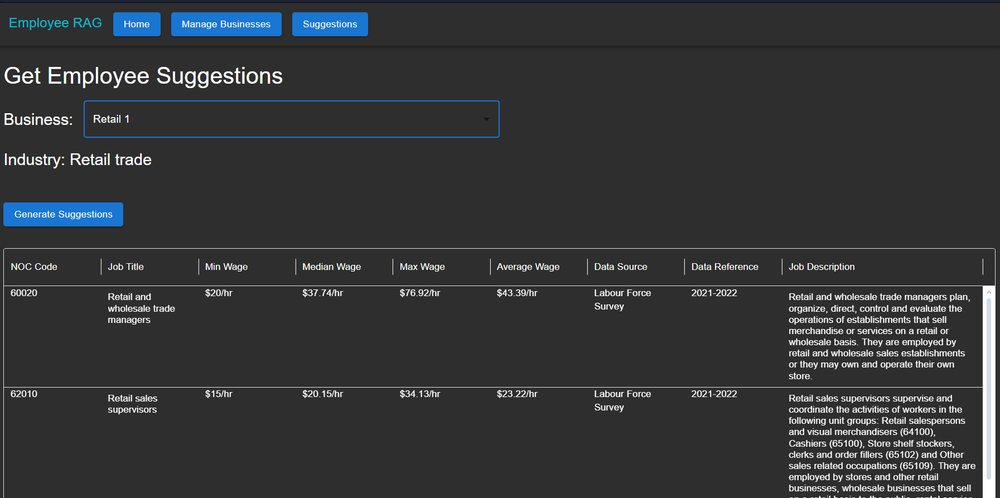

# Employee Role Suggestion Application

This full-stack application that uses AI to suggest employee roles and their wage information based on business type and industry classification. The application uses NOC (National Occupational Classification) and NAICS (North American Industry Classification System) data to provide suggestions for hiring employees for your business.



## Technology Stack

### Backend

- NestJS framework
- Apollo GraphQL Server
- Prisma ORM
- PostgreSQL database
- OpenAI integration for AI suggestions with LangChain

### Frontend

- React
- Material-UI (MUI) components
- Apollo GraphQL Client
- TypeScript

## Prerequisites

- Node.js (v20 or higher)
- Docker Desktop
- npm package manager

## Project Structure

```
project-root/
├── .vscode/ # VS Code configuration and tasks
├── server/ # NestJS backend
│ ├── src/
│ │ ├── app/ # App module and configuration
│ │ ├── business/ # Business logic and GraphQL types
│ │ ├── llm/ # AI/LLM integration with OpenAI
│ │ ├── naics/ # NAICS module for industry codes
│ │ └── data/ # CSV data files for seeding
│ ├── prisma/ # Database schema and migrations
│ └── lib/ # Utility functions and data imports
├── client/ # React frontend
│ └── src/
│ ├── pages/ # React components and pages
│ └── components/ # Shared React components
└── api-access/ # Shared GraphQL types and queries
```

## Setup Instructions

1. Clone the repository

2. Install dependencies for all packages:

```
bash
npm install
cd server && npm install
cd ../client && npm install
cd ../api-access && npm install
```

3. Set up the local database using Docker:

```
bash
docker-compose up -d
```

4. Create a `.env` file in the server directory:

```
# Environment variables
# POSTGRES
POSTGRES_USER=postgresUser
POSTGRES_PASSWORD=postgresPassword
POSTGRES_DB=postgresDb

# Nest run locally
DB_HOST=localhost
# Nest run in docker, change host to database container name
# DB_HOST=postgres
DB_PORT=5432
DB_SCHEMA=public

# Prisma database connection
DATABASE_URL=postgresql://${POSTGRES_USER}:${POSTGRES_PASSWORD}@${DB_HOST}:${DB_PORT}/${POSTGRES_DB}?schema=${DB_SCHEMA}&sslmode=prefer

# Nest
API_PORT=3033

# Security
JWT_ACCESS_SECRET=nestjsPrismaAccessSecret
JWT_REFRESH_SECRET=nestjsPrismaRefreshSecret

# OpenAI
OPENAI_API_KEY="Your OPENAI API KEY"
```

5. Using VS Code Run Tasks (Recommended):
   - Open the project in VS Code
   - Press `Ctrl/Cmd + Shift + P`
   - Type "Tasks: Run Task"
   - Select "Prisma Generate & Push & Seed"
   - After completion, select run task "Run Dev Environment"

## Available VS Code Tasks

- **Prisma Generate & Push & Seed**: Sets up database schema and loads initial data
- **Run Dev Environment**: Starts both frontend and backend development servers

## Features

- Business profile creation and management
- AI-powered employee role suggestions based on NAICS codes
- Wage information from Canadian labor market data
- Interactive data grid for viewing suggestions
- Multi-level NOC code selection process
- Real-time updates and status tracking
